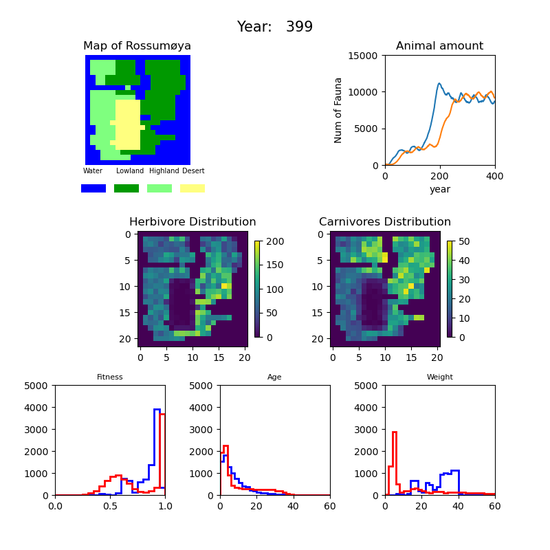
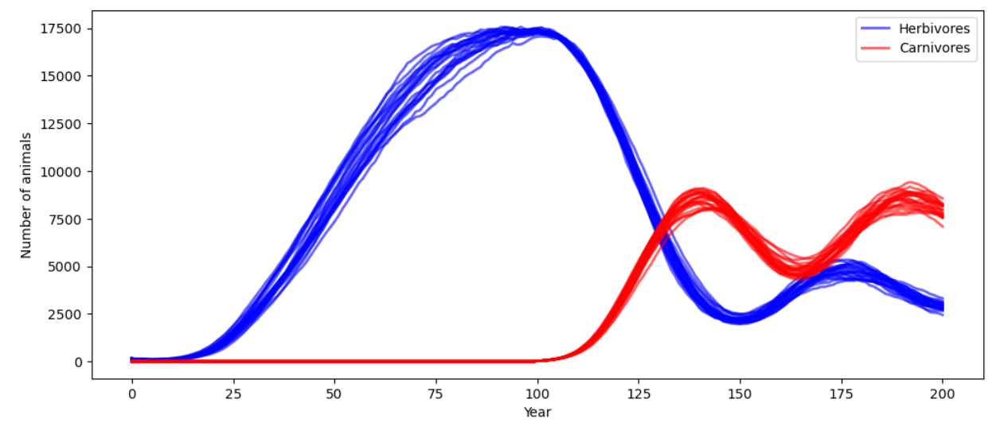

# Project background
Please read the *project_description.pdf* and the documentation in *docs/_build/html/index.html*

# Simulation process video
This vedio shows the simulation process for 400 years:

https://github.com/Hongpengzh/Ecosystem-simulation/assets/127026756/5dec5a22-a642-4083-9734-c7f3a9d7d6aa

# Simulation result snapshots

# How to run the project
To run the simulation, you should install all the packages in conda enviroment *projectenv.yaml*.

Then you could set initial parameters and call *simulate()*
as *sample_sim.py* or *check_sim.py* showed in *reference_examples*.

In the process of the simulation, the figures will show the dynamic of below:

1. The map of the island.
2. The amount of herbivores and carnivores.
3. The year counter.
4. The distribution colormaps of herbivores and carnivores.
5. The histograms of animal fitness, age and weight.

After the simulation, you can call makemovie() method to get the movie of the simulation. 

## What we did
### Codes
1. Codes can run out of box.
2. Both herbivores and carnivores in the map
3. All landscape types and migration
4. Complete visualisation (map, heatmaps, total animal counts, histograms)
5. Parameters for animals, landscapes and plotting can be set
6. Packaging, python -m build and tox works
7. Follow PEP8 rules, pass all flake8 tests.
### Tests
1. Pass all tests in *test_biosim_interface.py*
2. Have unit tests for each module
3. Use some advanced techniques, like parameterization, fixtures.
### Documentation
1. Have meaningful docstrings for all classes and methods
2. Use advanced Sphinx features, e.g., example code, note boxes, and figures
## Author
 Hongpeng Zhang & Sujan Devkota
